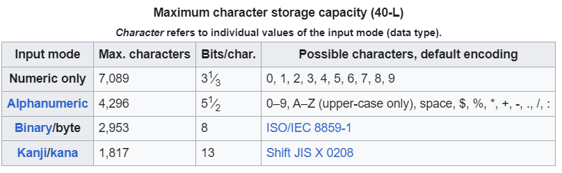

# QRCodeGenerator

Trying to code a QR code generator in Python. Most of the information contained here was found at [Wikipedia](https://en.wikipedia.org/wiki/QR_code) and [Thonky's QR Code Tutorial](https://www.thonky.com/qr-code-tutorial/data-encoding). This is meant to be a challenge, therefore no one else's code was consulted.

## Understanding the QR Code

QR Codes are widely used to store information and present it in a very compact and easy to process pattern. They can store large amount of information while allowing for the reading device to correct errors and perspective.

This is done by storing information both vertically and horizontally in the following sections ([reference](https://www.avast.com/c-what-is-qr-code-how-to-scan#:~:text=QR%20codes%20work%20by%20arranging,translated%20into%20human-readable%20information.)):

- Quiet Zone: The empty white border around the outside of a QR code.

- Hinder pattern: The three black squares in the bottom-left, top-left, and top-right corners.

- Alignment pattern: A small square near the bottom-right corner, which ensures the QR code can be read, even if it’s skewed or at an angle.

- Timing pattern: An L-shaped line that helps to identify individual squares within the whole code, making it possible for a damaged QR code to be read.

- Version information: Identifies which version of the QR code is being read, which basically informs the dimensions of the matrix.

- Data cells: The rest of the QR code communicates the actual information — the URL, phone number, or other data.

For now, I will stick Version 1 (21x21), the simplest version, which can encode up to 25 alphanumeric characters. This information can be found [here](https://www.qrcode.com/en/about/version.html).

There are also different levels of Error Correction, all of them based on the [Reed-Solomon error correction](https://en.wikipedia.org/wiki/Reed%E2%80%93Solomon_error_correction):

- Level L (Low)	7% of data bytes can be restored.
- Level M (Medium)	15% of data bytes can be restored.
- Level Q (Quartile)	25% of data bytes can be restored.
- Level H (High)	30% of data bytes can be restored.

For now, I will only be implementing the Low Level, although I hope to be able to implement all of them in the future.

All of the QR codes 

## Types of QR Codes

There are several types of QR Codes such as **original QR code**, **Azted code**, **Maxi code**, **PDF417**, **Semacode** and the **Micro QR code**. Each one of them have their own pros and cons and I intendend to implement all of them at some point, starting by the original QR code.

There are also four modes in which the QR code can be generated: **numeric**, **alphanumeric**, **byte** and **kanji**. Here, the only mode implemented is the alphanumeric mode.

## Implementation

This program implements the QR code as a matrix of 0's and 1's that can be formatted to any tipe of file.

